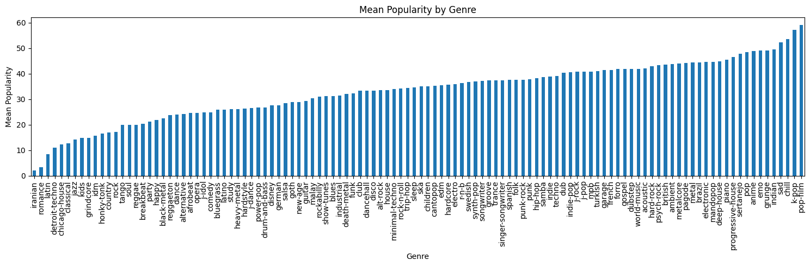

# Spotify Popularity Prediction (Master 2 project)
<p align="center">
  
</p>

## Competition Overview
- Kaggle competition: [Spotify popularity prediction](https://www.kaggle.com/competitions/spotify-predire-la-popularite-dun-titre/overview)
- Objective: predict the `popularity` score (0-100) for each track in the test set using the provided audio features and metadata
- Evaluation metric: coefficient of determination `R^2`

## Repository Layout
- `src/modelling/train.py`: main entry point that orchestrates preprocessing, model selection, cross-validation, and final training
- `makefile`: convenience targets for training, submission, and reproducibility workflows
- `notebooks/`: exploratory analysis and research notebooks

## Setup
Clone the repo, download the data from Kaggle, place the data at `src/data/train_data.csv`, `src/data/test_data.csv`.

This project uses `uv`, install the environment and dependencies with:

```bash
uv sync
```

## Workflows
- Default configuration (ensemble mode with cross-validation and final training):
  ```bash
  make train
  ```
  The make target forwards common hyperparameters such as `MODE`, `EXECUTION`, `FOLDS`, and search settings. Override them as needed, for example `make train MODE=m1 FOLDS=10`.
- Run the trainer directly without make:
  ```bash
  python -m src.modelling.train --mode ensemble --seed 42 --folds 5
  ```
  Additional arguments are exposed via `python -m src.modelling.train --help` and include controls for model selection (`--m1-models`, `--m2-models`), nested CV settings, blending, and feature importance reporting.
- Reproduce the results with:
  - `make repro_m_search` for the search of the `m` hyperparameter
  - `make repro_results` for the nested CV with hyperparameter search, model selection, final full training and output of the submissions csv.
- `make submit SUBMIT_FILE=submission.csv SUBMIT_MSG="New ensemble run"` To easily submit to Kaggle using their CLI.

## Training idea
The pipeline uses nested CV with decile-stratified outer folds to drive hyperparameter search, model selection, and ensembling.

We train two tracks: M1 (no-genre) predicts popularity directly but without the track_genre information; M2 (genre-residual) predicts residuals over a smoothed per-genre mean mu(g) with a shrinkage hyperparameter m (in practice searched on a grid with a base Random forest, to find it before the main search/selection/training).

For M2, we essentially predict the popularity of a song relative to the songs of the same genre (and offset back with mu(g) at the end to get the final prediction).

For each spec (Random forest, XGBoost, ...), inner CV evaluates defaults hyperparameters (and randomized search for M2), then the best spec is chosen by out-of-fold (OOF) R2.

M2 can also blend the top bagging (Random Forest / Extra trees) and boosting (XGBoost / CatBoost) models with a convex weight learned to maximize OOF R2. Finally, we either pick the best of {M1, M2, blend} or learn an M1+M2 weight `w` (for `p = w·M2 + (1–w)·M1`) from OOF R2, refit on all data, and infer.

All steps are leakage-safe (folded transforms, custom column scaling, engineered features like time-signature one-hots and circle-of-fifths).
